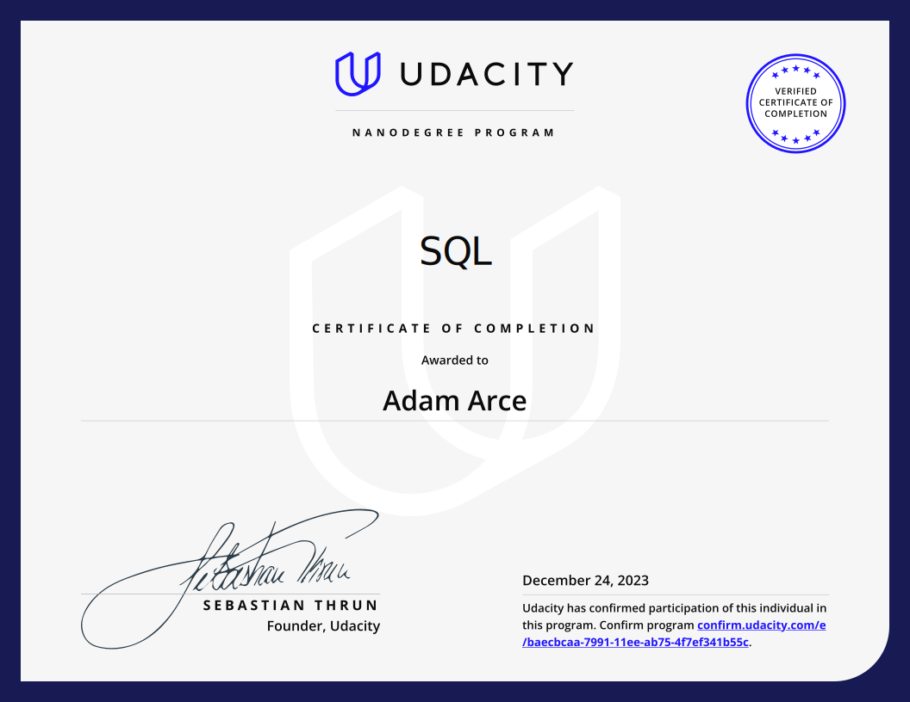

# SQL Nanodegree

The Udacity Nanodegree implements project-based learning. This directory is a collection of the two projects required. 

## Folder Structure

```bash

|-- README.md
|-- 01-Deforestation_Exploration/
|-- |-- Deforestation_Exploration_Report.pdf
|-- |-- forestation_exploration.sql
|-- |-- regions.csv
|-- |-- forest_area.csv
|-- |-- land_area.csv
|-- |-- forestation.csv
|-- |-- README.md
|-- 02-Udiddit_A_Soical_New_Aggregator/
|-- |-- bad-db.sql
|-- |-- part_II-new_schema.sql
|-- |-- part_III-migrate.sql
|-- |-- Udiddit, a social news aggregator.pdf


```

## Project 1: Deforestation Exploration
### Introduction to SQL
In this project, I complete a Report for ForestQuery into Global Deforestation, 1990 to 2016. I use SQL queries to explore the given forestation dataset.

## Project 2: Udiddit, A Social News Aggregator
### Management of Relational & Non-Relational Databases
In this project, I assess and fix issues with the fictional social news aggregator, Udiddit. 



